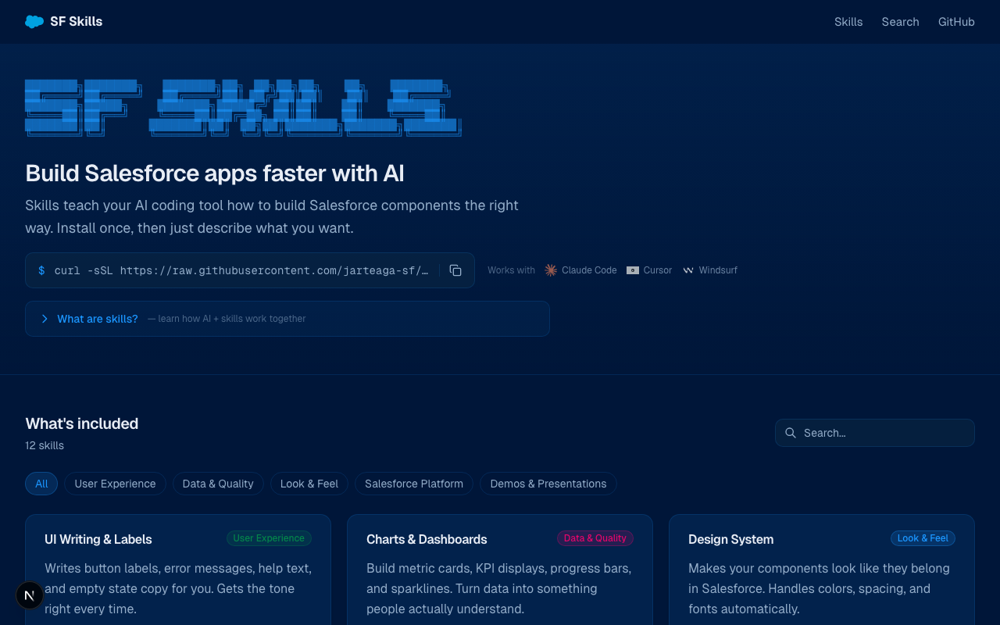
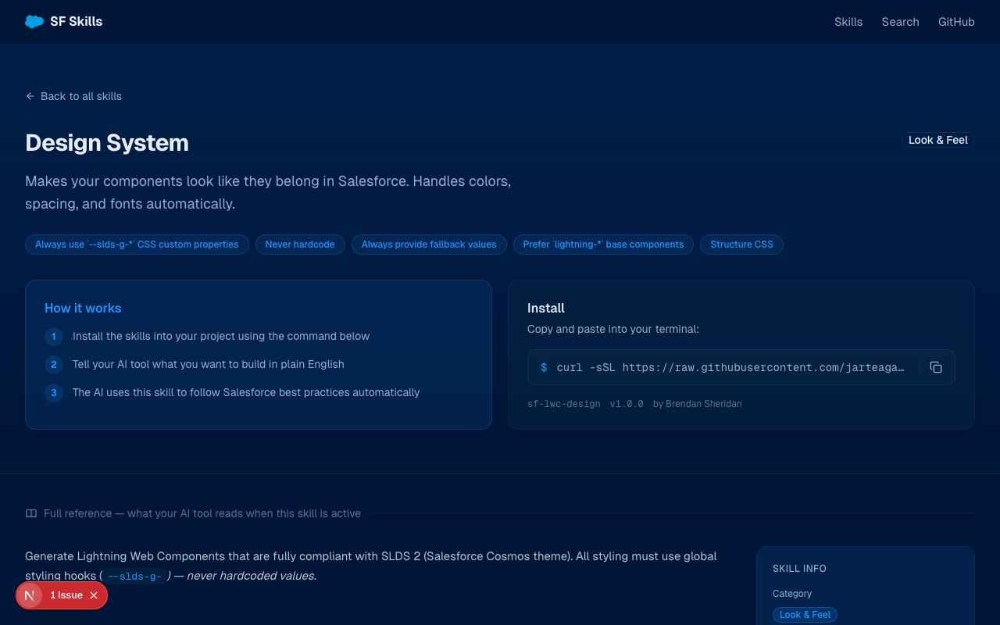

# SF Skills

A browsable library of AI coding skills for Salesforce Lightning Web Component development. Skills teach your AI coding tool (Claude Code, Cursor, Windsurf) how to build Salesforce components the right way — correct SLDS 2 patterns, accessibility, theming, and best practices — installed in one command.




## What it does

- Browse and search 12+ LWC skills by category
- One-line install command to add skills to any project
- Key capability highlights extracted from each skill's core rules
- Collapsible reference sections for easy scanning
- Metadata sidebar with version, author, license, and compatible tools
- Related skill suggestions within the same category
- Works with Claude Code, Cursor, and Windsurf

## Tech stack

- [Next.js 16](https://nextjs.org) (App Router, static export)
- [Tailwind CSS v4](https://tailwindcss.com)
- [shadcn/ui](https://ui.shadcn.com) components
- Markdown-based skill content via [gray-matter](https://github.com/jonschlinkert/gray-matter)

## Getting started

```bash
npm install
npm run dev
```

Open [http://localhost:3000](http://localhost:3000).

## Available scripts

| Script | Description |
|--------|-------------|
| `npm run dev` | Start development server |
| `npm run build` | Production build |
| `npm run lint` | Run ESLint |

## Adding a skill

Create a new folder under `content/skills/<skill-name>/` with a `SKILL.md` file. The frontmatter fields are:

```markdown
---
title: My Skill
description: Short description shown on the card
category: Look & Feel
icon: Palette
install: claude skills add my-skill
---

# My Skill

Full skill documentation here...
```

## CI / Deployment

GitHub Actions runs lint and build on every push to `main`. The site is deployed to GitHub Pages via a static export.
